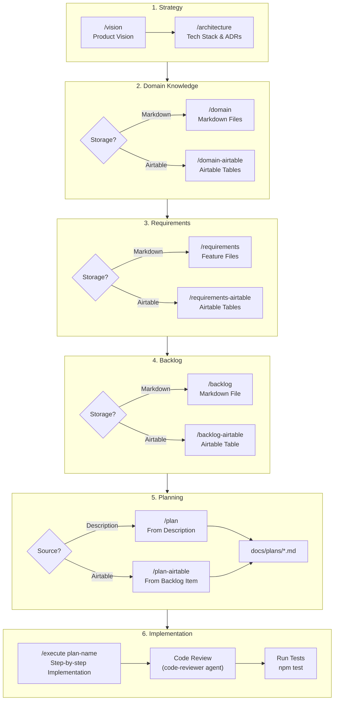
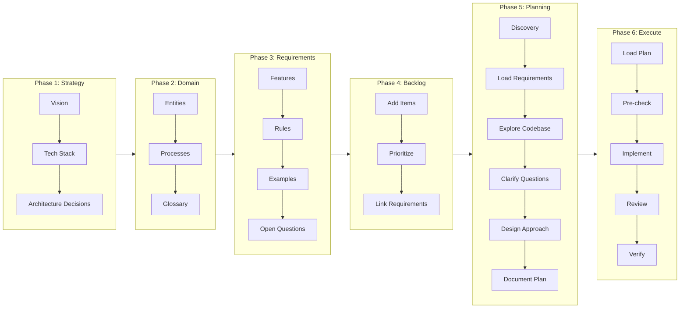
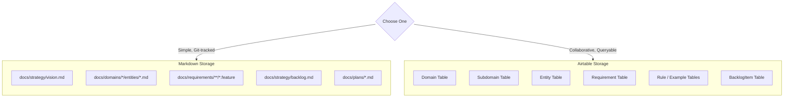
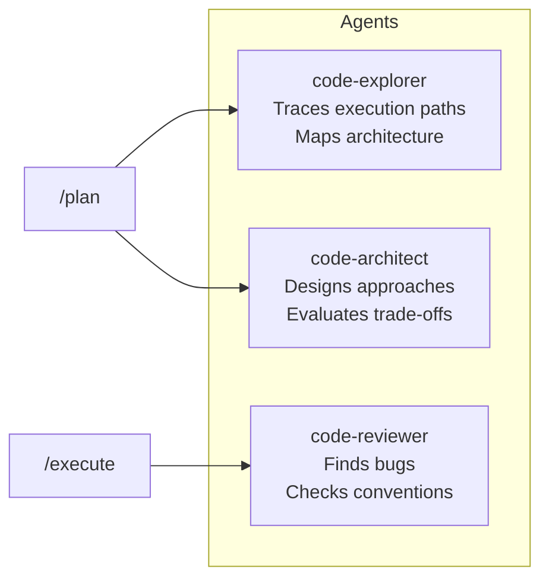
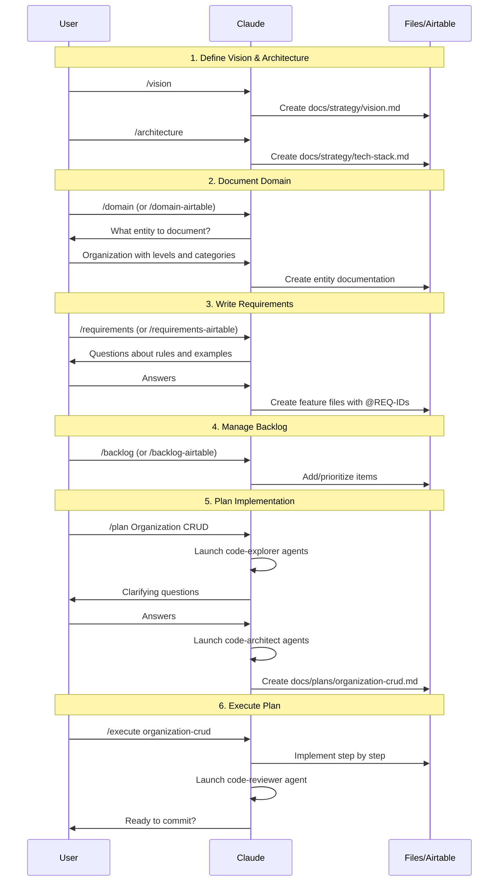

# Development Process

This document outlines the AI-assisted BDD development workflow using the PM plugins.

## Process Overview

## Detailed Phase Diagram

## Storage Options

Each phase offers a choice between **Markdown** (local files) and **Airtable** (cloud database):

### When to Use Each

| Aspect | Markdown | Airtable |
|--------|----------|----------|
| Version Control | Git-tracked | Airtable history |
| Collaboration | Via Git PRs | Real-time |
| Querying | Manual search | Filters & views |
| Setup | None | MCP server required |
| Offline | Yes | No |

## Commands Reference

| Phase | Markdown Command | Airtable Command |
|-------|-----------------|------------------|
| Vision | `/vision` | - |
| Architecture | `/architecture` | - |
| Domain Knowledge | `/domain` | `/domain-airtable` |
| Requirements | `/requirements` | `/requirements-airtable` |
| Backlog | `/backlog` | `/backlog-airtable` |
| Planning | `/plan` | `/plan-airtable` |
| Execution | `/execute` | `/execute` |

## Agents

The planning plugin includes specialized agents:

## Example Workflow

## Key Principles

1. **No Assumptions** - Always ask questions, never invent domain details
2. **Traceable** - Every feature has a unique requirement ID (SUB-CAP-NNN)
3. **Test-Driven** - Requirements are executable BDD scenarios
4. **Iterative** - Plan → Execute → Review → Refine
5. **Collaborative** - Human-in-the-loop at every decision point
