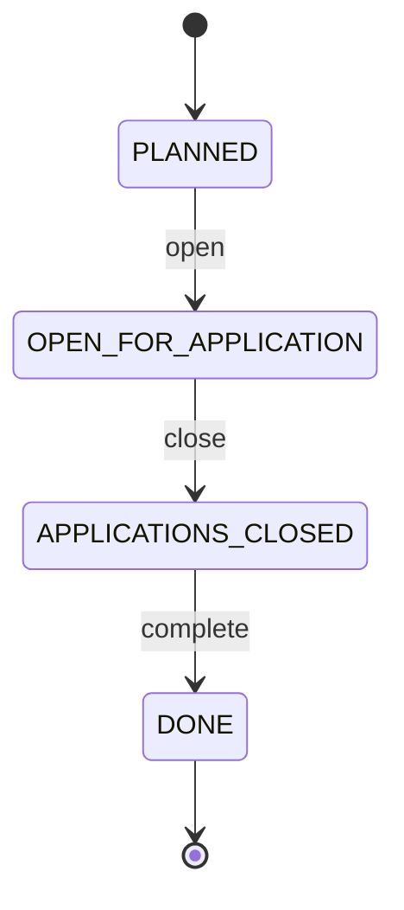
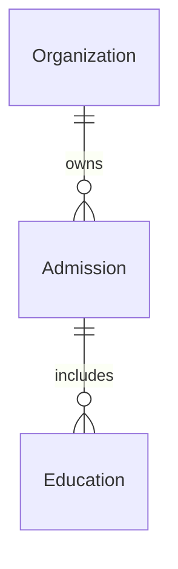

# Admission

A coordinated admission process/round for education programs, such as "UHG 2025" for bachelor educations in Norway.

## Attributes

| Attribute | Type | Required | Description |
|-----------|------|----------|-------------|
| id | UUID | Yes | Unique identifier |
| name | String | Yes | Name of the admission round (e.g., "UHG 2025") |
| description | String | No | Description of the admission round |
| applicationOpens | DateTime | Yes | When applications open |
| applicationDeadline | DateTime | Yes | When applications close |
| status | AdmissionStatus | Yes | Lifecycle state |

## Enums

### AdmissionStatus

| Value | Description |
|-------|-------------|
| `PLANNED` | Admission is being planned, not yet open |
| `OPEN_FOR_APPLICATION` | Applications are being accepted |
| `APPLICATIONS_CLOSED` | Application period has ended |
| `DONE` | Admission process is complete |

## Lifecycle

## Relationships

- **Organization owns Admission**: An organization creates and manages admission rounds
- **Admission includes Education**: An admission round includes multiple education programs that students can apply to

## Notes

- Admissions are owned by a single organization
- Organizations add their own educations to admissions they own
- No student information is stored on the Admission entity (handled elsewhere)
- The admission coordinates the application period via open/close dates
