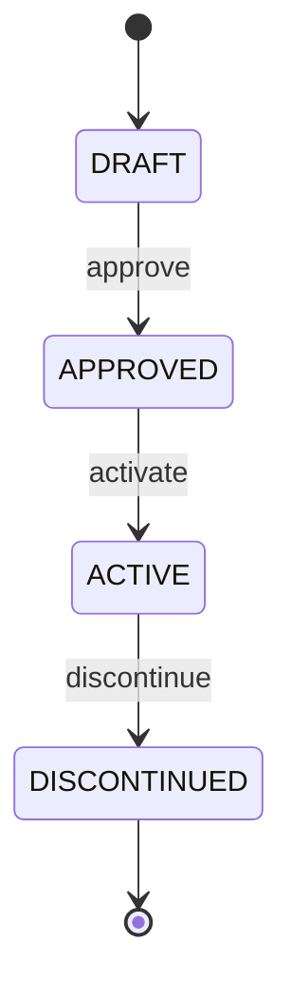
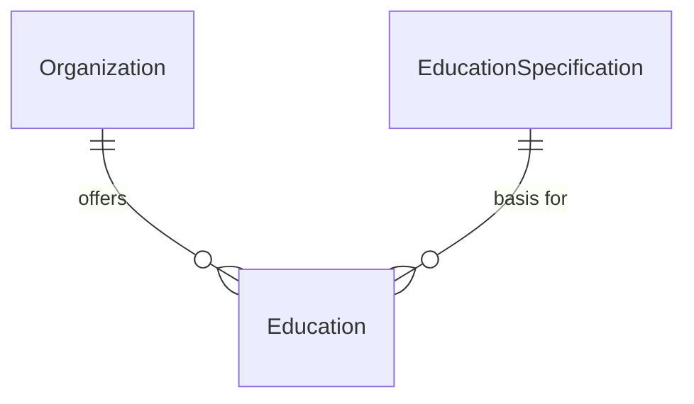

# Education

An education program offered by an organization, such as a bachelor's degree or certificate program.

## Attributes

| Attribute | Type | Required | Description |
|-----------|------|----------|-------------|
| id | UUID | Yes | Unique identifier |
| name | String | Yes | Full name of the program (e.g., "Bachelor of Computer Science") |
| code | String | Yes | Short code (e.g., "BCS-2024") |
| description | String | No | Program description |
| level | EducationLevel | Yes | Degree level |
| credits | Integer | No | Total credits required |
| durationYears | Integer | No | Expected duration in years |
| status | EducationStatus | Yes | Lifecycle state |

## Enums

### EducationLevel

| Value | Description |
|-------|-------------|
| `BACHELOR` | Undergraduate bachelor's degree |
| `MASTER` | Graduate master's degree |
| `DOCTORATE` | Doctoral degree (PhD, etc.) |
| `CERTIFICATE` | Professional certificate program |

### EducationStatus

| Value | Description |
|-------|-------------|
| `DRAFT` | Being designed, not yet offered |
| `APPROVED` | Approved but not yet accepting students |
| `ACTIVE` | Currently offered to students |
| `DISCONTINUED` | No longer accepting new students |

## Lifecycle

## Relationships

- **Organization offers Education**: An organization can offer many education programs
- **EducationSpecification basis for Education**: Many education programs can be based on a single specification

## Notes

- Education programs have a lifecycle from draft through active to discontinued
- Programs are always offered by exactly one organization
- The EducationSpecification relationship allows standardized programs across organizations
