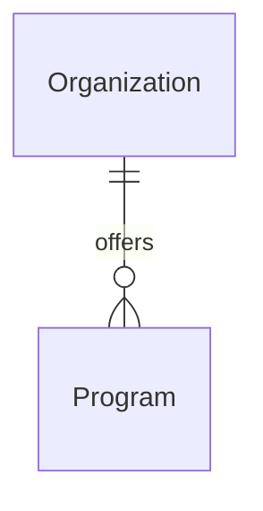

# Organization

An educational institution that offers programs and accepts applications for admission.

## Attributes

| Attribute | Type | Required | Description |
|-----------|------|----------|-------------|
| id | UUID | Yes | Unique identifier |
| name | String | Yes | Name of the organization |
| description | String | No | Brief description of the organization |
| level | OrganizationLevel | Yes | Educational level |
| category | OrganizationCategory | Yes | Focus/type of institution |

## Enums

### OrganizationLevel

| Value | Description |
|-------|-------------|
| `UNIVERSITY` | Degree-granting higher education institution |
| `COLLEGE` | Two or four-year higher education institution |
| `HIGH_SCHOOL` | Secondary education institution |

### OrganizationCategory

| Value | Description |
|-------|-------------|
| `LIBERAL_ARTS` | Broad humanities, social sciences, arts focus |
| `TECHNICAL` | Engineering, technology, applied sciences |
| `PROFESSIONAL` | Business, law, medicine, career-focused |
| `RESEARCH` | Research-intensive institution |
| `VOCATIONAL` | Trade skills, technical training |

## Relationships

## Notes

- Organizations are always active (no state management)
- Additional attributes (contact info, branding) may be added later
- Categories based on common educational institution classifications

## Sources

- [Carnegie Classification](https://carnegieclassifications.acenet.edu/)
- [SREB Institutional Categories](https://www.sreb.org/institutional-categories)
